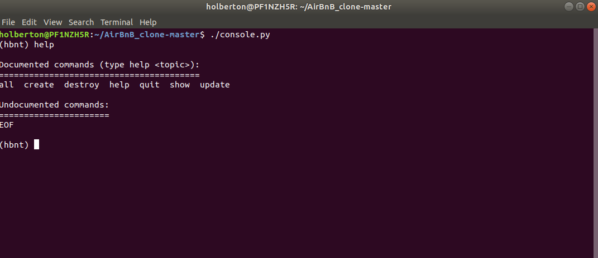
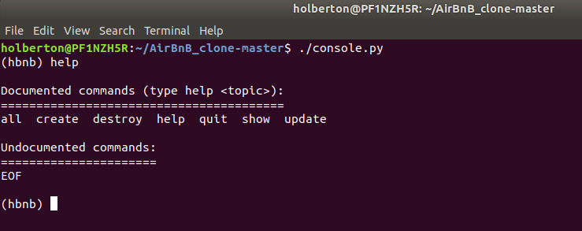

# AirBnB_clone
[**Airbnb**](https://www.airbnb.com/). is an online marketplace for arranging or offering lodging, primarily homestays, or tourism experiences. The company does not own any of the real estate listings, nor does it host events; it acts as a broker, receiving commissions from each booking.

The goal of the project is to deploy on our own server a simple copy of the [**AirBnB website**]((https://www.airbnb.com/)).

## Description of the project
---
We don’t implement all the features, only some of them to cover all fundamental concepts of the higher level programming track at [**Holberton**](https://www.holbertonschool.com/).

This is a long project in wich after 4 months, we have to complete a full web application composed by:

+ A command interpreter to manipulate data without a visual interface, like in a Shell (_perfect for development and debugging_).
+ A website (_the front-end_) that shows the final product to everybody: **static and dynamic**.
+ A database or files that store data (**data = objects**).
+ An API that provides a communication interface between the front-end and your data (_retrieve, create, delete, update them_).

This projects is made to build this application not all at once, but if **step by step**.

The firs part that we have to build of the whole project is: **AirBnB clone - The console**

## AirBnB clone - The console
---

This is the first part of our big project, in this part we buid a class in Python, that represents our data model.

The purpose of this model is have to:

+ Build our data model.
+ Perform operations like (_create, update, destroy, etc_) in the objects via a console.
+ Build a powerfull storage system, that be capable to store and persist objects to a file (**[JSON file](https://www.json.org/)**).

## How to start to use it
First at all, for use our application you have to clone our repository using the command on your terminal:

`git clone https://github.com/juanfe9118/AirBnB_clone.git`

Once this is done, a folder named **AirBnB_clone-master** is created, you have to go inside of it, using de command `cd` on your terminal.

`cd AirBnB_clone-master`

You're inside of AirBnB_clone-master folder, now you have to execute the console with the command:

`./console.py`

Done this, it shows us the console of our application, from here, we can interact with the application data.

## Examples
---
Now we are going to show some of the application features.

**help command**
This command show us the help for the most common actions on the console.

On the console type: `(hbnb) help`

**create**
create an instances of a class, usage: `(hbnb) create <ClassName>`

**all**
Show all created instances, usage `(hbnb) all`

**show**
Show info about a create instance of a class using id as parameter, usage: `(hbnb) show <ClassName> id`

## AUTHORS
---
- [Victor Arteaga](https://twitter.com/Xathovic)
- [Juan Felipe Buitrago](https://twitter.com/juanfe9118)
- [Jackson Moreno](https://twitter.com/jaarmore)

---

